# Sedon

Procedural 3D content generator built around a node graph. (super alpha)

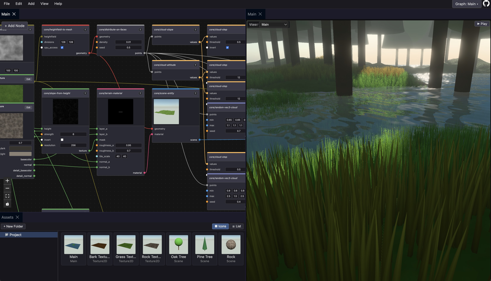

(sedon = nodes spelled backward - need a better name!)

[Live](https://greggman.github.io/sedon/?anim=1)

Currently you can save as a URL up to the maximum URL size. Or you can
download a file and then pick load to re-read it. If you make
something cool please post a link. This is alpha software those so expect
that the file format will change and old links might stop working.

Note: No idea how far I'll take this. The entire point was I wanted to
see big content from small data since IMO that's one of the biggest
reasons 3D isn't bigger on the web. for example, the forest above is 9k
gzipped. I don't know if this is a solution but I thought it might be fun to try to generate a close to AAA 3D web demo of a forest, jungle, dessert, city.

That was inspired by talks like
[this one on Battlefield](https://www.youtube.com/watch?v=tBXzyoK4GvE)
and of course things like this
[city generator](https://www.youtube.com/watch?v=A4qpjZ2SkJQ) and 
[forest generator](https://www.youtube.com/watch?v=Z_gChm3TNz8).
The blender ones aren't designed for real time graphics but I thought
it would be interesting to see what it would take to do real-time.

## Vibe Coding

This is vibe coded. Yes, I supervise and question implementation
choices but I've written near zero lines of code in this repo.
I'm making no claims about code quality. I know there are bugs though
I'm pretty positive most of them are similar to bugs I'd have and
have to work through.

I know it's only going to get better but I'm blown away. When I
say it's vibe coded I mean it! Other than React and ReactFlow
there are basically no libraries. And honestly I don't really know
what `ReactFlow` brings to the table because it's not actually
doing node layout. It seems to only be providing the connectors
and zoom/pan across a canvas. All the actual data flow etc, is
entire written by Claude.

Further, every shader, every effect, and every graph has been
created by Claude so far. I've tweaked a few numbers or colors
but Claude built all the sample graphs, all the compute and
render pipelines, etc... I worked with Claude to add caching
and tests so that ideally data is generated once and kept around.
I worked with claude to add the preview, camera controls, fly controls,
undo/redo, command patterns, filters, all the previews, etc.
It's incredible honestly.

I'd say, up to this point, ~4 weeks in, about 50% of the time
has been spent on UI issues (adding menus, adding a command palette,
adding multiple views, pop-out windows,
adding previews in nodes, fixing related caching bugs) and 50%
in the actual "core" nodes, rendering.

It's been crazy, I ask for bloom, it writes it. I ask for
Rayleigh scattering, it writes it. I ask for height-map
erosion, water, reflections, refraction, whatever, it writes
it. No frameworks, no existing 3d engine, ask for it and
generally, a few minutes later it's working.

Some things I had to help it with. I had it add WebGPU labels
at one point so it could figure out which WebGPU resources
were related to WebGPU errors. I had it write puppeteer tests
when it was having trouble finding bugs without actual WebGPU.
A few times it had trouble finding a bug and I'd suggest
making a smaller test case and using that to track it down.
I also suggested it make a Mock WebGPU api for testing non
WebGPU related flow.

### undo/redo/scripting

I asked for undo/redo. It added a command pattern, which we discussed
when asking for the feature. The idea, which is common, was to have
a command pattern for undo/redo but that would eventually enable
scripting.

Later I got tired of manually writing out the steps for making bug
repos so I asked it to make it possible to save and replay the commands
and it did. It was instantly useful being able to record my steps, then
try to play them back. If they repo the issue then just give claude the
repo. (add: `allow-macros=1` to the URL).

### Preview

I asked it to make a preview (the main renderer) and it just it.
Of course we added things over time like

rayleigh scattering

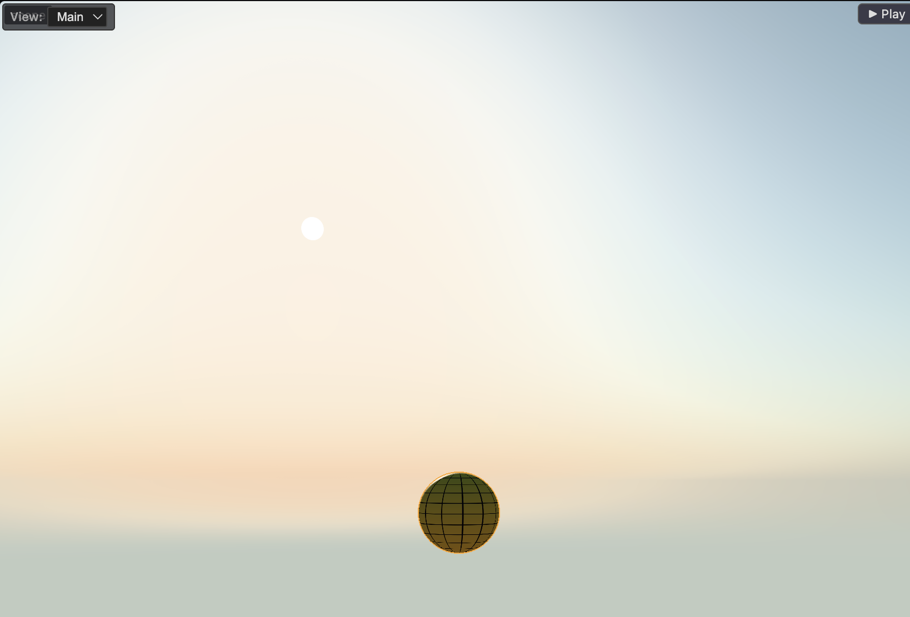

bloom

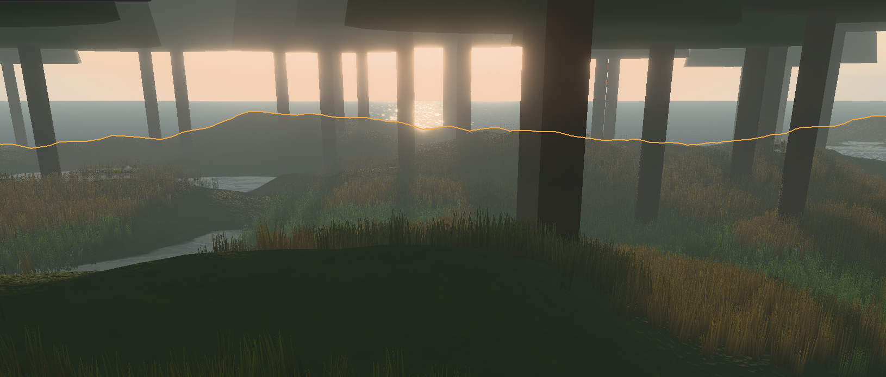

frustum based grass rendering with fade out

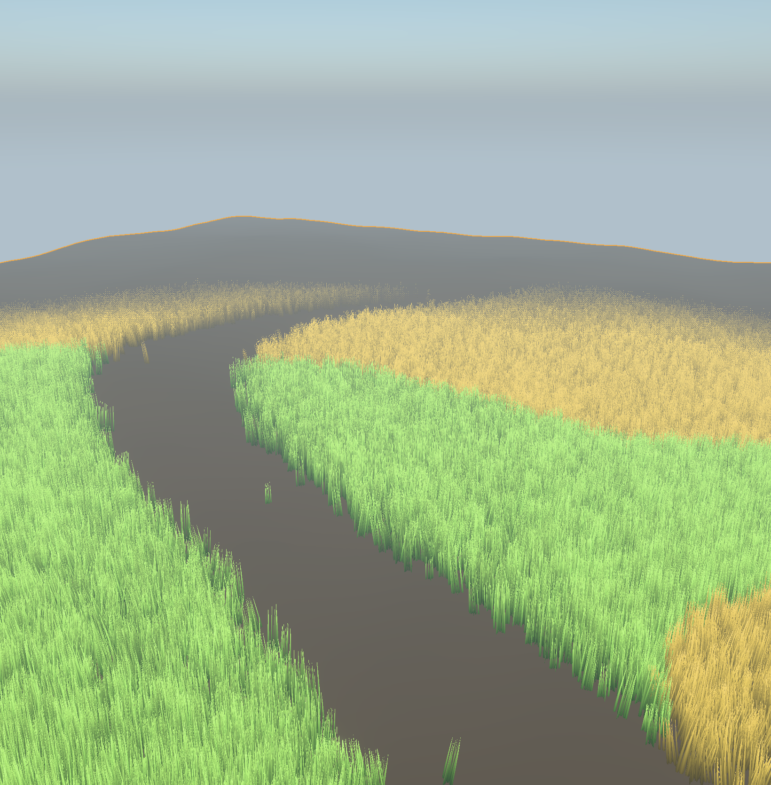

water with ripples and shorelines

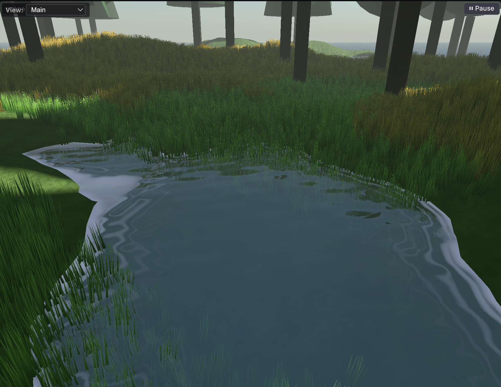

and terrain rendering with render time
LODing tesselation. (you can turn on debugging for that with `debugTerrainLOD=1`.
[example](http://greggman.github.io/sedon?scene=multi-layer-terrain&debugTerrainLOD=true))

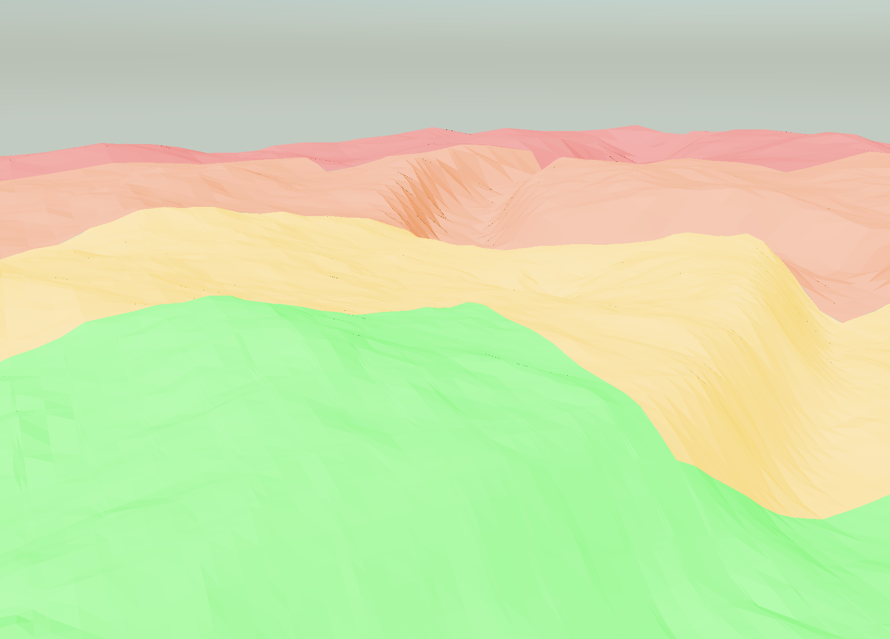

### multiple previews

Also, and not sure this is a good solution, but at some point some nodes output
multiple things and it seemed important to be able to see all of them. I suspect
this doesn't scale but we added it

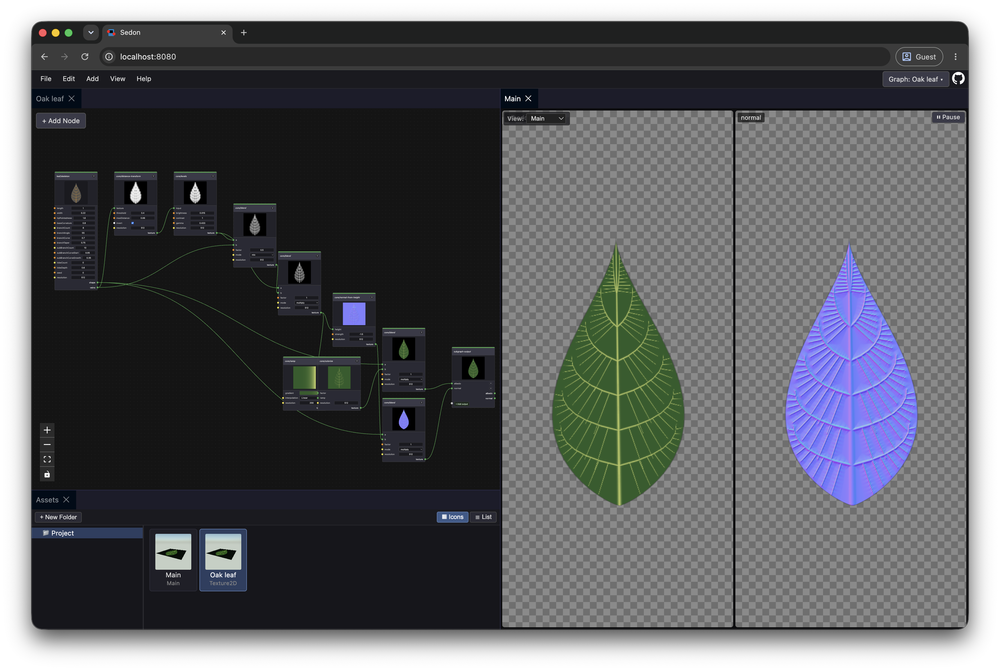

### Node previews

When we started, nodes didn't have previews. I'm not sure if having previews is
good (easier to understand) or bad (clutter for big flowcharts). But in any case,
we've added more and more of them as I ran into situations where I thought it would
help.

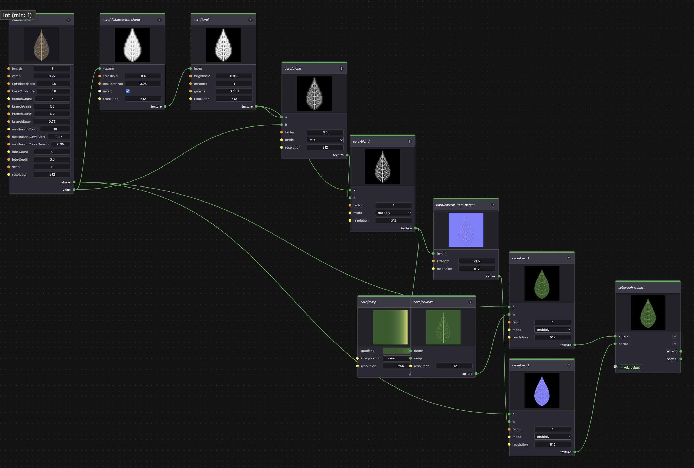

### Windowing

I asked it about a windowing system like VSCode (split windows, drag by tabs).
I think it recommended 3 libraries (or maybe that was Gemini). I thought one
would be better to Claude thought a different one would be better which pushed
me to look a little deeper. I did and was ok with it's choice.

I also asked for pop-out windows to work as a 3D editor like this needs lots
of screen space and if you have multiple monitors you really want to be able
to open multiple windows. Moments later this feature was working.

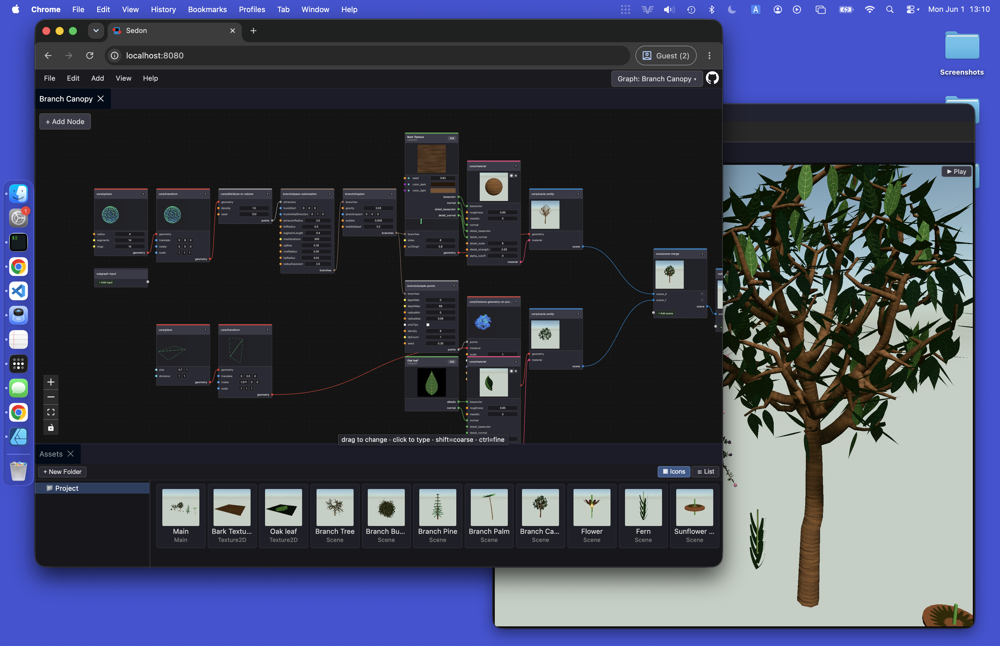

### [point-lists](https://greggman.github.io/sedon/docs/nodes/core/point-list/)

At some point it made a `spline` node and had practically hard coded 3 vertices
as its only input. Later, I asked it what to do about it, could we had a `point-list` node that provided the points and way to edit them. I asked
if it would be possible to edit in the preview, It seems arguably impossible
as there's a long way between where the points are used and how they end up
reflected in the preview. It told me other editors have a custom editor for 
this purpose so we went that route. A few iterations later and we had a custom
node editor for that

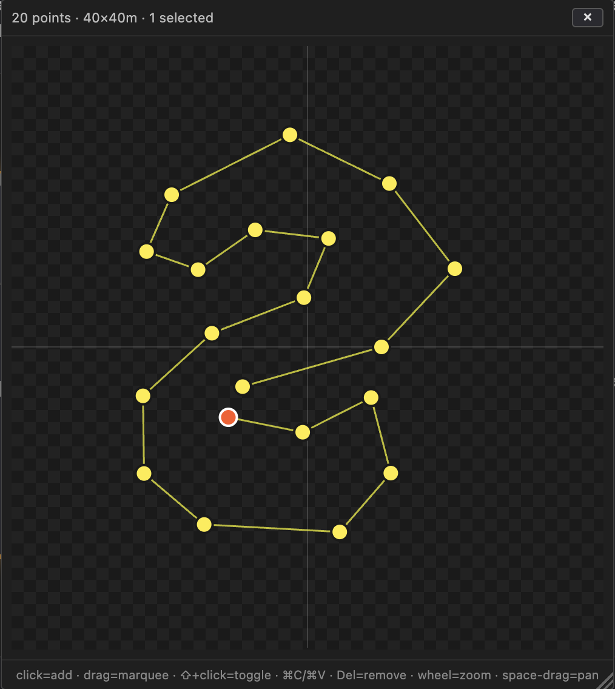

### [curve-2d](https://greggman.github.io/sedon/docs/nodes/core/curve-2d/)

Next up we needed more than point lists, we needed splines. It pushed back
a little saying we could do it later but I felt like doing it later would
cause more issues. Again, a few iterations later we had a curve editor

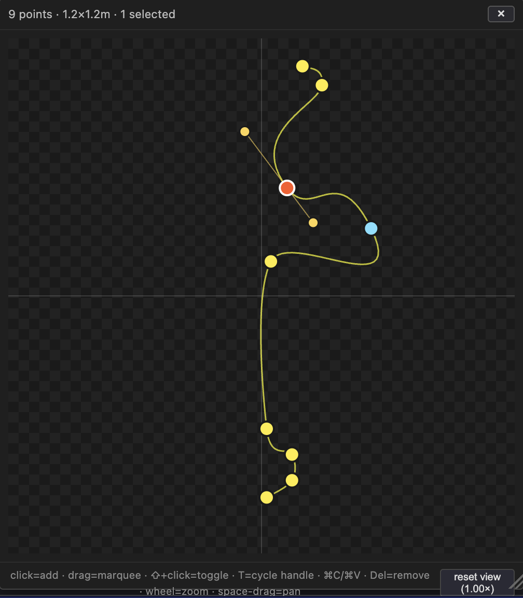

### for-each-xxx (for-each-point, for-each-edge, for-each-face, ...)

This one I'm not sure what other apps do here. Claude wrote something with
hard coded names and it actually seemed kind of messy. We worked through
it with me suggesting that a `for-each-xxx` node have an editable internal
graph where the user could connect iteration inputs from the `for-each-xxx`
to whatever they wanted. It remains to be seen if it was the right decision.

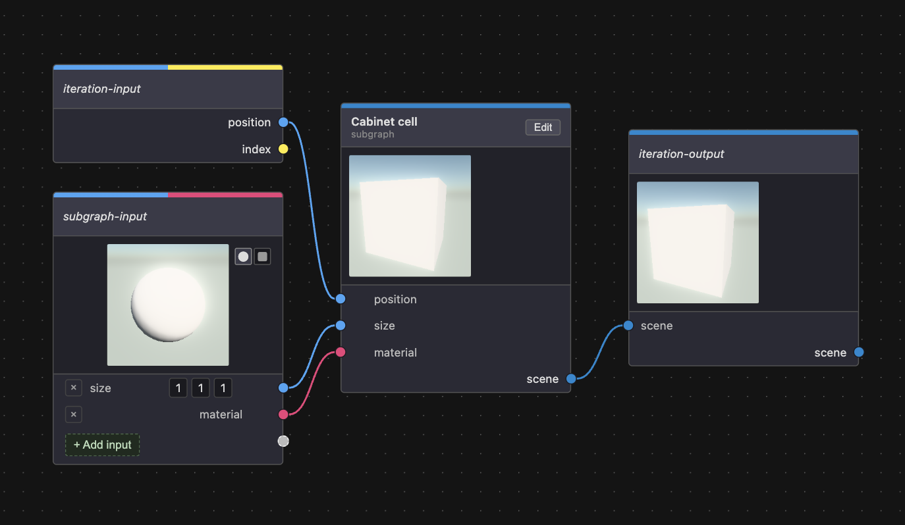

### Docs

At some point I asked Claude to
[generate docs](https://greggman.github.io/sedon/docs/) for each node. I specifically
asked it to store the info for the docs in the definition of the node itself.
My hope was, being there would make the AI aware of what's needed when adding new
nodes as the existed nodes and the typescript defs point it out.

Further, I asked it to generate live previews for each node. It works!
You can edit, to some degree, live in the docs. I think not every editing feature
works but it's enough to play a little with the example in the docs and
I can ask Claude to add whatever is missing.

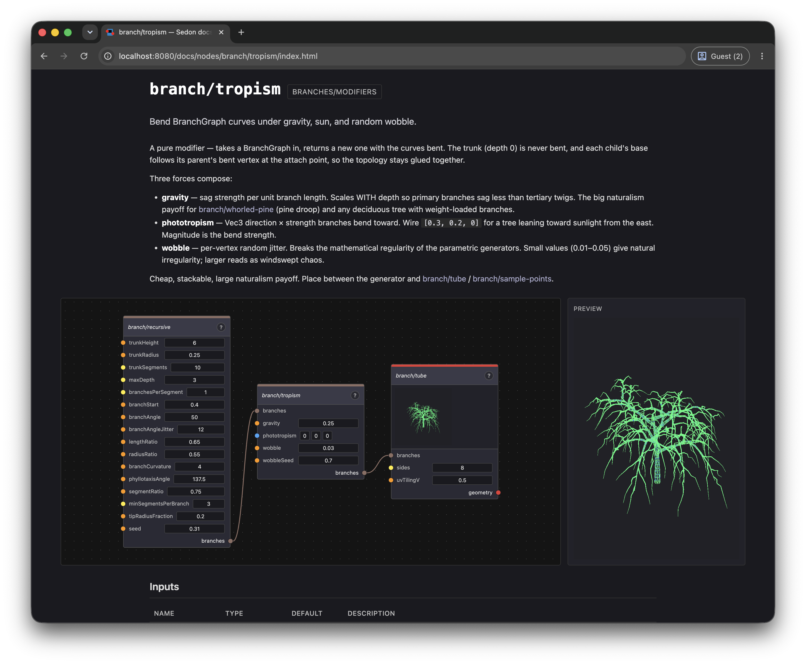

This also helped find bugs or missing features. If the docs don't work
or aren't useful then figure out what's need to make them so.

### Cut/Copy/Paste

At one point I asked for cut/copy/paste. At the time, Claude pushed back
and said it was a big feature with lots of design decisions. It wasn't
important then. Later, I wanted to be able to copy a generated tree
into the forest, which at the time had simple trees made of a cylinder with
a cone or sphere on top.

We worked though the issues and it mostly seems to work as expected though
I don't have extensive personal usage testing yet.

Here's an image where I loaded the demo tree & bush scene, copied two of the
trees. Then loaded the forest scene, pasted in the trees and wired them
to the instancing nodes

I haven't made this the default because it needs LODing, culling,
and more work to lower the poly count of the tree, merge leaves, etc.

### Mock WebGPU

At one point I asked it to Mock WebGPU so it could run much of the code
in node. I only bring that up as you might find something similarly useful
for your own stuff

### Puppeteer

Of course Puppeteer has been useful. We avoid it for a while but eventually
I got tired of hand testing and told Claude, "You could test this yourself
with puppeteer" and it was like "Yea, good idea!" 😂

### Showing it screenshots

It's also crazy how much it perceives screenshots. Working to get bevel correct
I ran into two issues. One, after bevel the preview no longer displayed.
We tried a lots of stuff and Claude went off the rails quite a bit trying to
find the issue. We had a simple graph cube->bevel->scene-entity->preview that wasn't
working. It tried to compare it to other scenes. I pointed out connecting cube
directly to scene-entity worked so the issue was not elsewhere. Anyway, we try
a bunch of different things. Eventually I asked Claude to export the data
after bevel to a json file so I could inspect it. Without prompting it helpfully
wrote both a .json file and .obj file, making it suitable for loading into blender.

There it became clear, regardless of the display bug, the algo it had made
wasn't quite working.

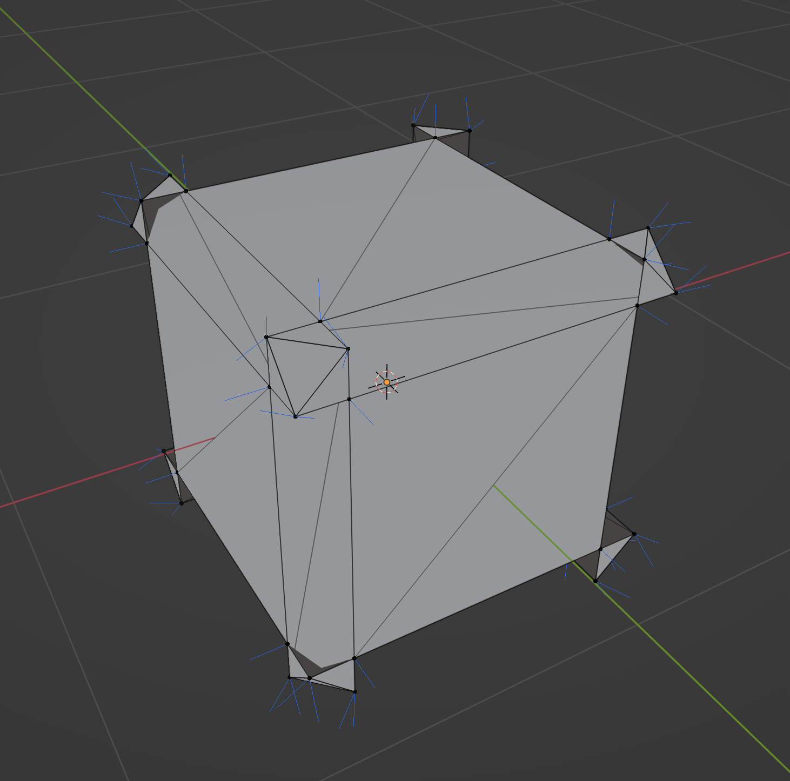

We decided to fix that first but it's new algo was both still off and still not displaying. It tried to explain with text diagrams. Finally I give it this screenshot
saying we wanted what's on the left, but what we had now was what was on the right.

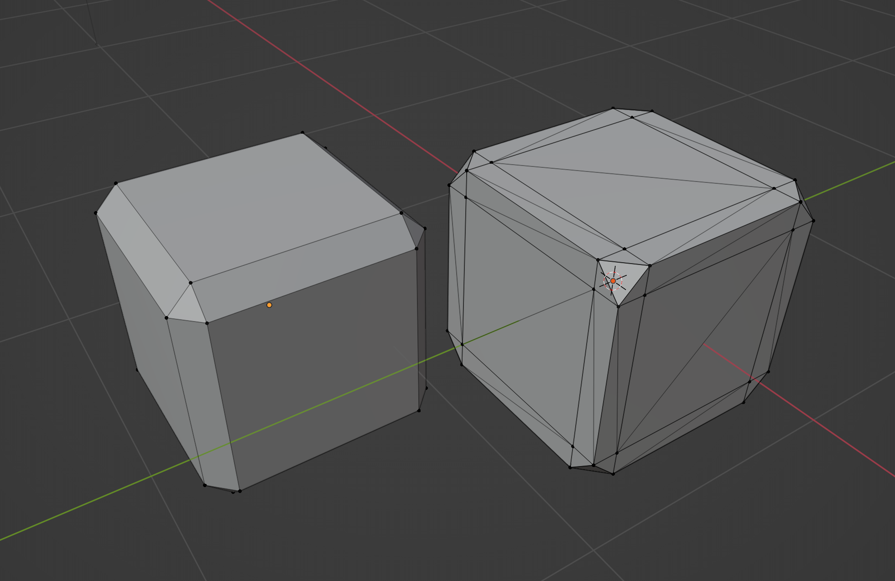

It claimed to see it immediately (incredible!) and described the difference correctly and how it needed to fix it.

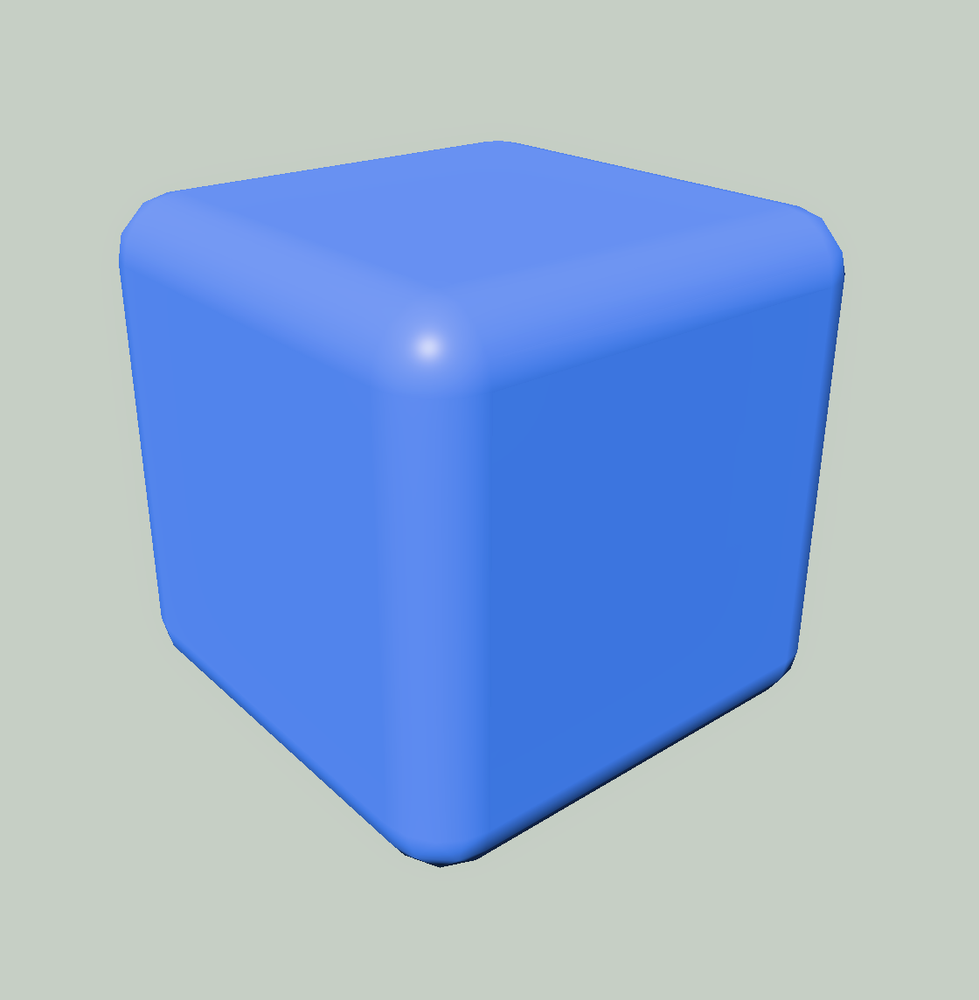

This wasn't the only case were I gave it screenshots.
I expected screenshots to work for widgets in UIs. I did not expect it to
work for graphics in general.

## Future

I honestly don't know. I see this as an experiment in Vibe Coding in
Spring 2026 and I expect I've hit my limit. The was done in my spare
time in less than a month. I didn't multi-task the AI. But, even
with all of this working, it feels 10% of the way to being actually
usable and I don't plan to spend another 9 months to get there.

I don't really have any plans to make this into a real app
for users. That would be a ton of work. It would probably require having
a server with users. It would require backward compatibility so users
creations kept working. Further, I have no idea how many users would find
it useful. It's not like you can use the results anywhere. Maybe we could
ask Claude to make it three.js based. But, even then, designing worlds
with nodes feels niche. A few technical artist might be into it but it
probably does not have a large audience.

There's also a long list of features it would need to be useful. LODing
being a big one. Maybe normal baking, building a complex object like a 
metal panel with rivets from geometry and turning that into a texture
with normal maps or parallax maps. Apps like Blender and Houdini are
not *generally* concerned with real time rendering.

Rather, I most hope it's inspiration. One for what's possible in 2026
with vibe coding. Another is just how good it is. Just ask for it and
it writes it. It's not always correct on the first try but if you're
good at describing what's wrong and finding ways to give it data and
ways to repo issue you can get there. Also,that there's a lot of unexplored
space for 3D on the web.

## License: MIT

